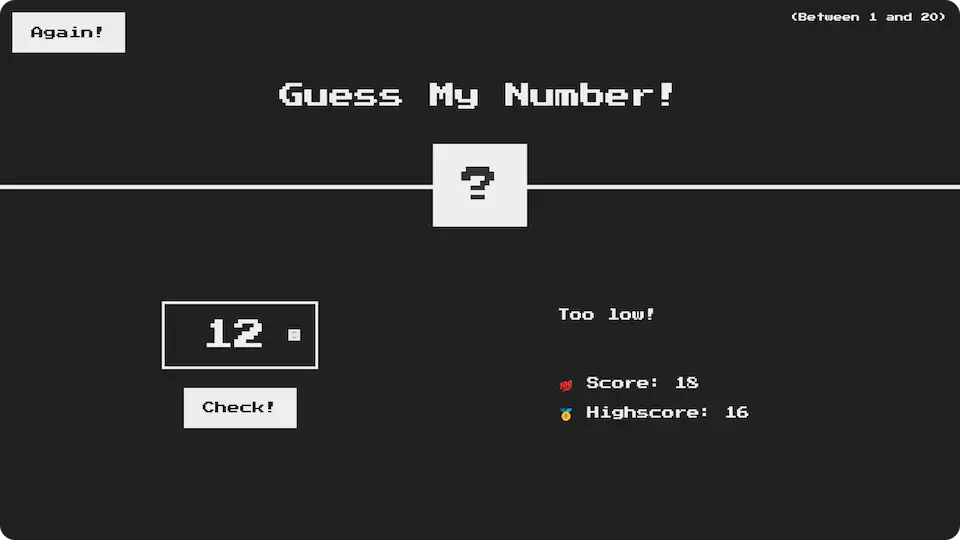

# 📲 Guess My Number

**Guess a random number between 1 and 20.**

## 💻 Screenshot

## 🛠️ Tools and technologies
`JavaScript` `HTML` `CSS` `VS Code`

## 🌐 Deployment
Deployed on `Netlify`.

Live preview at [dawidlehai-guess-my-number.netlify.app](https://dawidlehai-guess-my-number.netlify.app/).

## ℹ️ Instructions
Try to guess a number hidden under the question mark box! Write your answer in the light-bordered block on the bottom left and click on the button `CHECK!` or press `ENTER`. The text on the right will indicate if your number is higher or lower than the number in question. You start with 20 score points. Every time you make a mistake the score decreases. Your best score will be saved (per session) in the `HIGHSCORE` field. Have fun! 😁

## 🎓 Related course
This project was created as a part of the [Udemy](https://www.udemy.com/ 'Udemy') course [_The Complete JavaScript Course 2022: From Zero to Expert!_](https://www.udemy.com/course/the-complete-javascript-course/ 'See this course on Udemy') by [Jonas Schmedtmann](https://twitter.com/jonasschmedtman 'Jonas Schmedtmann on Twitter').
